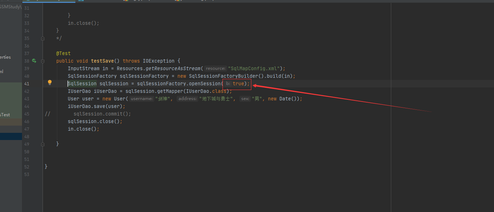
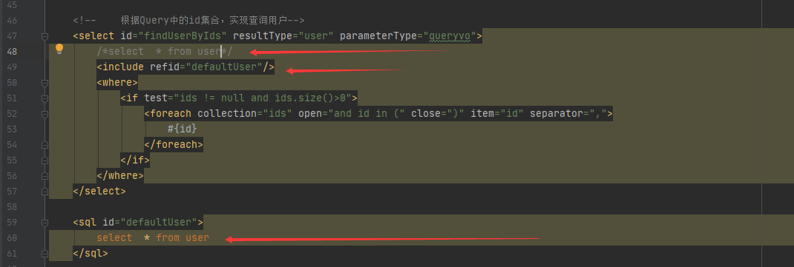

###这个项目主要学习了连接池的概念，以及POOLED和UNPOOLED的区别
- 第二个，之前在修改数据的时候，比如，插入一条数据的时候，需要在最后写上：<br/>`opensession.commit(); `<br>
但是现在不需要了，可以在箭头所指的位置，<br><br>`opensession()`方法添加`true`参数就可以了，就不需要再写`sqlSession.commit();`<br>
- **条件查询** <br>
    1.使用`<if>`标签<br>
    ```
     <!--根据条件查询-->
        <select id="findUserByCondition" resultType="user" parameterType="user">
            select * from user where 1= 1
            <if test="username != null">
                and username = #{username}
    
            </if>
            <if test="sex != null">
                and sex = #{sex}
            </if>
        </select>
    ```
  2.但是能注意到第9行有个 `where 1 = 1 `,这样看起来不够完美，所以我们可以使用`<where>`标签，具体看IUser.xml文件
  ```
   <select id="findUserByCondition" resultType="user" parameterType="user">
          select * from user
          <where>
              <if test="username != null">
                  and username = #{username}
              </if>
              <if test="sex != null">
                  and sex = #{sex}
              </if>
          </where>
          
      </select>
  ```
  3.对于`select * from user where id in(41,42,52)`这种查询方式，在mybatis中，可以使用**foreach标签**来操作<br/>
    - 注意：`itm`的属性和第41行的#{}中的内容一定要一致，注意看代码，不仅仅是xml文件
  ```
    <select id="findUserByIds" resultType="user" parameterType="queryvo">
          select  * from user
          <where>
              <if test="ids != null and ids.size()>0">
                  <foreach collection="ids" open="and id in (" close=")" item="id" separator=",">
                      #{id}
                  </foreach>
              </if>
          </where>
     </select>
  ```
  4.在mapper.xml文件中，对于重读的sql语句，可以使用下图<br><br>其实没啥用，知道就行,注意重复的sql后面不要写分号，会报错
    
    
